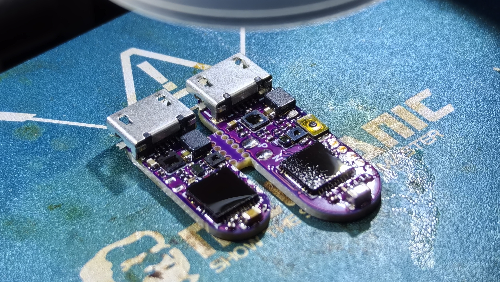
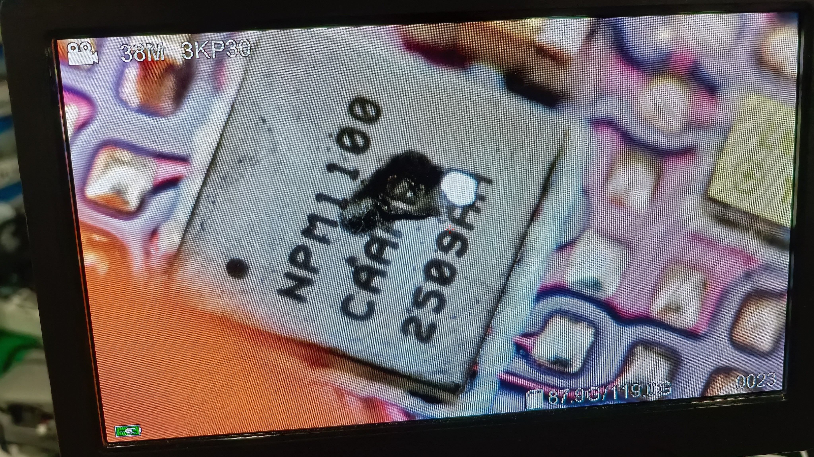

# PixPill PCB & Enclosure Assembly Guide

## PCB Soldering

### Required Tools and Supplies

- **Microscope**: a magnifier or microscope is required for BGA and 0201 components.
- **Soldering iron**: fine tip.
- **Hot plate and hot-air gun**: for reflowing WLCSP and BGA packages. A hot plate is recommended for the LED side; use a hot-air gun for the IC side.
- **Solder paste**: 183°C paste for the first side and 138°C low-temperature paste for the second side. A stencil is recommended for 1#.
- Flux, **fine-tip tweezers**, solder, and board-cleaning solution.

### Recommended Soldering Order

1. **Solder the LED array first**: apply solder paste, place the LEDs one by one in batches, and reflow them in batches on the hot plate.
2. After finishing the first side, turn the board over and secure it before placing the components on the second side:
   1. **SMD resistors, capacitors, and inductors (R, C, L)**
   2. **nPM1100**, **IS31FL3736**, **BMA530** (keep the package level), and **STM32C011** (hot-air soldering)
   3. **MicroUSB connector and button**
3. **Battery**: solder it with the soldering iron.

### Important Notes

- **BGA/WLCSP**: check that the solder is evenly distributed. After soldering, verify that no side is lifted and that there is no solder leakage or bridging underneath.
- **0201 LEDs**: they are extremely small and move easily. Batch soldering is strongly recommended.
- **nPM1100**: after soldering, connect USB and verify that VOUTB is approximately 3.0–3.2 V. During automatic shutdown, confirm that the 3.0 V rail drops to around 0.5 V relative to GND and continues to decrease slowly. If it remains around 3.1 V, the nPM1100 is very likely poorly soldered; rework it.
- **Battery**: always solder the battery last to avoid shorting or reversing the battery leads during assembly. Confirm the polarity carefully.

> **Warning:** WLCSP components should be used as soon as possible after purchase. Otherwise, they may absorb moisture; when heated, the moisture can expand inside the package and cause the die to crack or the component to fail.

## 3D Enclosure Assembly

1. Complete PCB soldering, flash the firmware, and verify that the board passes testing.
2. After soldering the battery, insert the PCB into the slot in the lower shell. The side with the longer battery recess corresponds to the battery slot; confirm the board orientation and position.
3. Install the button retainer in its reserved position. **First apply 502 adhesive (cyanoacrylate) or another suitable adhesive to the PCB-mounted button.** Insert the PCB into the lower shell, then insert the small button part from outside the shell and press it firmly against the PCB-mounted button.
4. Snap on the upper shell. The enclosure uses a slight interference fit.
5. Insert the microUSB cable to wake the device and verify normal operation.

### Interference-Fit Reference

- 000#: 
- 1#: 
