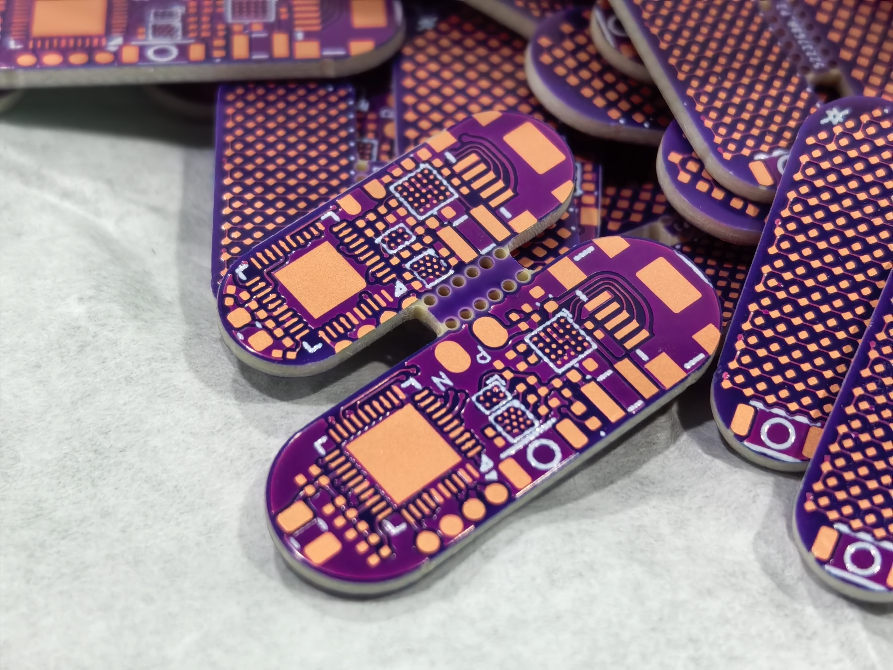
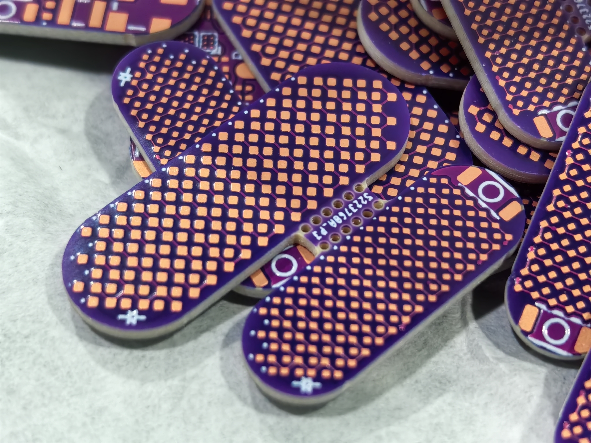

# PixPill Hardware Design

> Schematics, PCB, BOM, and enclosure assembly guide

> [ENGLISH](Hardware%20Design.md) | [中文](Hardware%20Design_zh-CN.md)

PixPill went through the EVK v1 → EVK v2 → 000# + 1# iterations. From the EVK validation boards to the final capsule-sized designs, the hardware integrates an MCU, IMU, LED driver, 96 micro LEDs, PMIC, and Li-Po battery in an extremely compact space.


---

## Hardware Architecture

```
        ┌──────────────────────────────────────┐
        │              nPM1100                 │
        │  Li-Po Charger + LDO + Ship Mode     │
        │  VOUTB (3.0V) → MCU, IMU, LED Driver │
        └──────┬─────────────────┬─────────────┘
               │ CHG (PB7)       │ ERR (PA8)
        ┌──────▼─────────────────▼─────────────┐
        │           STM32C011D6Y6TR            │
        │          Cortex-M0+ @ 48 MHz         │
        │               WLCSP12                │
        └──┬───────────┬──────────┬────────────┘
           │ I2C1      │ TIM3_CH2 │ SHPACT (PC15)
           │ (SCL:PB6  │ PA7      │ → Ship Mode
           │  SDA:PC14)│          │
       ┌───▼───┐       ▼          ▼
       │       │  LED_STATUS   nPM1100 SHPACT
  ┌────▼────┐  │  (breathing)
  │ BMA530  │  │
  │ IMU     │  │
  │ I2C     │  │
  └─────────┘  │
               │
  ┌────────────▼──────────────┐
  │        IS31FL3736         │
  │  12×8 LED Matrix Driver   │
  │  I2C, per-LED 8-bit PWM   │
  └────────────┬──────────────┘
               │ 96× LED Matrix
     ┌─────────▼───────────┐
     │ 96× 0402 / 90× 0201 │
     │  Pill-shaped layout │
     └─────────────────────┘
```

---

## Schematic Connections


### MCU and IMU

| MCU Pin | Function | Connected to |
|---------|----------|--------------|
| PA7 | TIM3_CH2 (PWM) | LED_STATUS |
| PA8 | GPIO input (pull-up) | nPM1100 ERR |
| PB6 | I2C1_SCL | BMA530 SCL + IS31FL3736 SCL |
| PC14 | I2C1_SDA | BMA530 SDA + IS31FL3736 SDA |
| PB7 | GPIO input (pull-up) | nPM1100 CHG |
| PC15 | GPIO output | nPM1100 SHPACT (ship-mode control) |

- **BMA530** I2C address: `0x18 << 1`
- **IS31FL3736** I2C address: `0x50 << 1`
- Both devices share the same I2C1 bus.

### Power Management (nPM1100)

- **VBUS** (microUSB) → nPM1100 charging input
- **VOUTB** (3.0 V LDO output) → MCU, BMA530, IS31FL3736, and LED array
- **CHG** → PB7 (charge-status indicator, low = charging)
- **ERR** → PA8 (fault indicator, low = fault)
- **SHPACT** → PC15 (high = enter ship mode and shut down VOUTB)

### IS31FL3736 LED Matrix

- 12×8 matrix driver, with 96 LED positions used in the pill-shaped layout
- I2C paged register addressing (Frames 0–7), with independent 8-bit PWM for each LED
- Initial GCC (global current control) value: 25; adjust it according to battery level and LED brightness

---

## PCB Design

| 000# | 1# |
| --- | --- |
|  |  |
|  |  |

### Process Parameters

| Parameter | Value |
|-----------|-------|
| Layers | 4-layer, 1st-order HDI |
| Board thickness | 1.2 mm |
| Minimum trace/space | 2.7 mil |
| Minimum hole size | 0.1 mm (laser blind microvia) / 0.25 mm (mechanical through-hole) |
| Surface finish | OSP, via-in-pad, plated cap |
| Solder mask color | Purple |

### Stackup

| L4 | L3 | L2 | L1 |
| --- | --- | --- | --- |
|  |  |  |  |

| Layer | Purpose |
|-------|---------|
| **Top (L1)** | MCU (WLCSP12), BMA530 (WLCSP6), IS31FL3736 (QFN), battery pads, SWD, USB, and GND |
| **Inner1 (L2)** | Signals, power, and GND |
| **Inner2 (L3)** | LED SW/CS signals |
| **Bottom (L4)** | LED array |

- L1→L2 uses laser blind microvias, L2→L3 uses buried vias, and L3→L4 uses blind vias.
- Some WLCSP pads use via-in-pad laser microvias.

### LED Array Layout

The pill-shaped 96 (000#) / 90 (1#) LED layout is arranged from top to bottom as follows:

```
   000# (0402) LED:                     1# (0201) LED:
       ○ ○          Row 0                 ┌─────┐        Row 0–1 Button
     ○ ○ ○ ○        Row 1                 └─────┘
   ○ ○ ○ ○ ○ ○      Rows 2–15           ○ ○ ○ ○ ○ ○      Rows 2–15
   ○ ○ ○ ○ ○ ○                          ○ ○ ○ ○ ○ ○
   ○ ○ ○ ○ ○ ○      (full rows)         ○ ○ ○ ○ ○ ○      (full rows)
       ...          (12 rows of 6)          ...          (12 rows of 6)
   ○ ○ ○ ○ ○ ○                          ○ ○ ○ ○ ○ ○
     ○ ○ ○ ○        Row 16                ○ ○ ○ ○        Row 16
       ○ ○          Row 17                  ○ ○          Row 17
```

- **000#** uses 96× 0402 LEDs (larger packages, easier to hand-solder).
- **1#** uses 90× 0201 LEDs (extremely small; a microscope and precision soldering are required).

### Cost

Because these are small HDI boards, the PCB cost is **very high**, mainly due to HDI engineering, blind/buried vias, and testing. The quotation below is for 135 EBA panels ordered from JLCPCB: approximately **RMB 11.4 per board**, including shipping. The stencil cost an additional RMB 60.


> *Approximately 120 EBA boards are still available (2026.09.15). If you would like to reproduce this project, contact me at (willitourt@foxmail.com). I can provide them at almost the cost price of **RMB 12 per board (~ 1.7 USD/board)**, excluding shipping.*  

### PCB Variants

| Variant | PCB size | LED package | Status |
|---------|----------|-------------|--------|
| **EVK v1** | 22×22 mm | 0402, 64 LEDs | Deprecated |
| **EVK v2** | 41.979×24 mm | 0201, 96 LEDs | Validation board, producible |
| **000#** | 23.9×8.6 mm | 0402, 96 LEDs | Producible |
| **1#** | 19.5×6.9 mm | 0201, 90 LEDs | Producible |
| **EBA** (Embedded Board Array) | — | — | Producible |

EVK v1/v2 are standard 2-layer boards for firmware development and component validation. 000# and 1# are 4-layer HDI boards reduced to capsule dimensions. EBA is a panel containing 000# and 1# boards.

---

## BOM

See the [PCBs directory](PCBS), which contains `BOM_EVK_V2_TestSchematic_2.xlsx`, `BOM_000# Capsule_Schematic2.xlsx`, and `BOM_7_19 1# Capsule_Schematic1.xlsx`.

Key components:

- **MCU**: STM32C011D6Y6TR WLCSP12
- **IMU**: BMA530 WLCSP6
- **LED driver**: IS31FL3736 QFN (5×5 mm)
- **LEDs**: 96× 0402 (000#) / 90× 0201 (1#)
- **PMIC**: nPM1100-**CAAA-E-R7** WLCSP25

---

## Soldering and Assembly

See the [Assembling Guide](Assembling%20Guide.md) for detailed PCB soldering and enclosure assembly instructions.

---

## 3D Enclosure

All part models are in the [3D Shell directory](3D%20Shell/), provided in SLDPRT, SLDASM, STEP, STL, and 3MF formats.

### Components

| Part | Material | Process |
|------|----------|---------|
| Main shell | 8001 clear resin / PLA | 3D printing (FDM or SLA; SLA strongly recommended), with optional sanding and polishing |
| Button retainer | General-purpose 3D-printing material | 3D printing (SLA recommended) |
| PCB mounting | — | Directly embedded in the enclosure |

### Assembly Order

See the [Assembling Guide](Assembling%20Guide.md) for the complete assembly order.

---

## Design Files

| File | Format | Description |
|------|--------|-------------|
| Schematics | PNG | Variant subdirectories under `PCBs/Schems and Layout/` |
| PCB layouts | PNG | Top, bottom, and inner layers in the same directories |
| Gerber files | ZIP | Variant- and process-specific files under `PCBs/Gerber/` |
| LCEDA projects | epro2 | `PCBs/EasyEDA(LCEDA) Projects/` |
| 3D enclosure | STEP / STL | `3D Shell/STEP_STL_3MF/` |
| SolidWorks source | SLDASM / SLDPRT | `3D Shell/SW/` |
